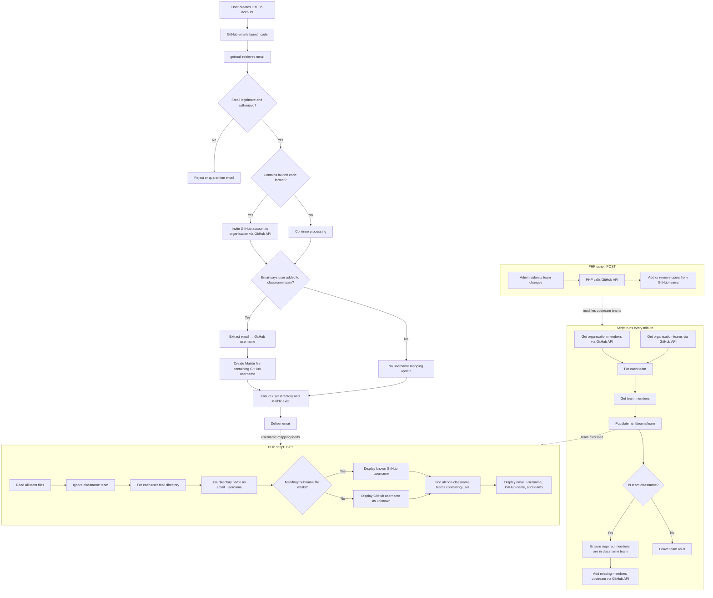

```mermaid
flowchart TD
  A[User creates GitHub account] --> B[GitHub emails launch code]
  B --> C[getmail retrieves email]

  C --> D{Email legitimate and authorised?}
  D -- No --> E[Reject or quarantine email]
  D -- Yes --> F{Contains launch code format?}

  F -- Yes --> G[Invite GitHub account to organisation via GitHub API]
  F -- No --> H[Continue processing]

  G --> I{Email says user added to classname team?}
  H --> I

  I -- Yes --> J[Extract email ↔ GitHub username]
  J --> K[Create Maildir file containing GitHub username]
  I -- No --> L[No username mapping update]

  K --> M[Ensure user directory and Maildir exist]
  L --> M
  M --> N[Deliver email]


  subgraph MinuteScript[Script runs every minute]
    P[Get organisation members via GitHub API]
    Q[Get organisation teams via GitHub API]
    P --> R[For each team]
    Q --> R
    R --> S[Get team members]
    S --> T[Populate html/teams/team]
    T --> U{Is team classname?}
    U -- Yes --> V[Ensure required members are in classname team]
    V --> W[Add missing members upstream via GitHub API]
    U -- No --> X[Leave team as-is]
  end


  subgraph PHPGet[PHP script: GET]
    AA[Read all team files]
    AA --> AB[Ignore classname team]
    AB --> AC[For each user mail directory]
    AC --> AD[Use directory name as email_username]
    AD --> AE{Maildir/githubname file exists?}
    AE -- Yes --> AF[Display known GitHub username]
    AE -- No --> AG[Display GitHub username as unknown]
    AF --> AH[Find all non-classname teams containing user]
    AG --> AH
    AH --> AI[Display email_username, GitHub name, and teams]
  end


  subgraph PHPPost[PHP script: POST]
    BA[Admin submits team changes]
    BA --> BB[PHP calls GitHub API]
    BB --> BC[Add or remove users from GitHub teams]
  end


  N -. username mapping feeds .-> PHPGet
  T -. team files feed .-> PHPGet
  PHPPost -. modifies upstream teams .-> MinuteScript
```
